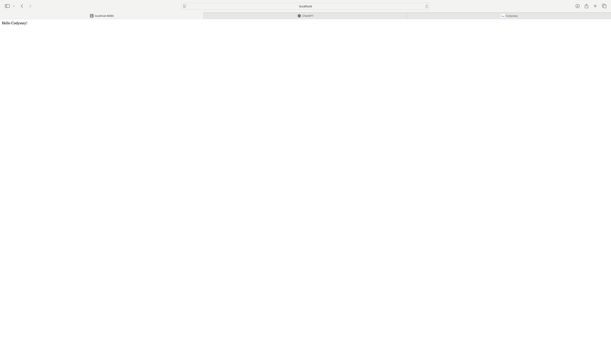
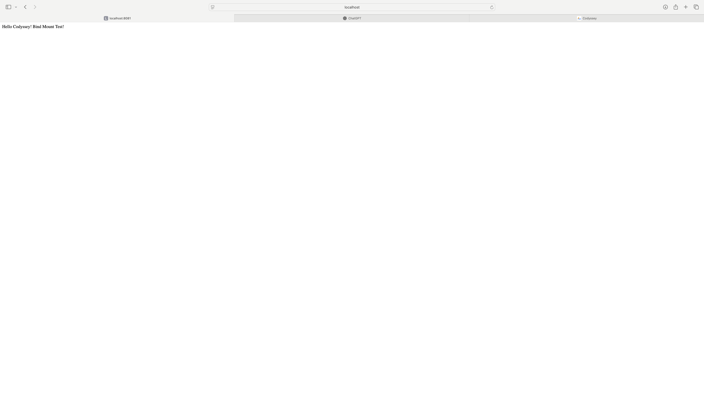
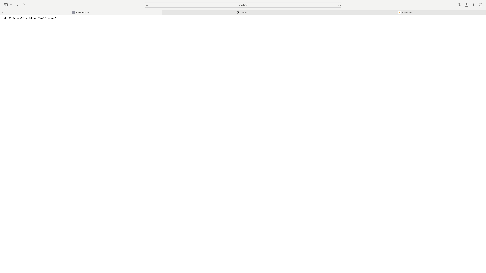

# E1-1 AI/SW 개발 워크스테이션 구축

## 1. 프로젝트 개요

  이번 프로젝트는 AI/SW 개발 워크스테이션 구축을 목표로 한다. 개발은 단순히 코드를 작성하는 순간이 아니라, 환경을 세팅하는 순간부터 시작된다. 따라서 학습자는 로컬 개발 환경을 구성하고, 재현 가능한 실행 환경을 만들며, 협업 가능한 상태로 프로젝트를 관리할 수 있어야 한다.

주요 목표는 다음과 같다.

1. 터미널 환경 이해 및 활용
- 디렉토리 구조 생성, 권한 설정, 파일/폴더 관리 등 기본 CLI 조작
2. Docker 기반 컨테이너 환경 구축
- Docker 설치 및 점검
- 컨테이너 실행/관리
- 포트 매핑을 통해 호스트-컨테이너 간 접근 확인
- 바인드 마운트와 볼륨을 활용한 변경 반영과 데이터 영속성 검증
4. Git/GitHub를 통한 관리 및 협업 환경 구성
- Git 사용자 정보 설정, 기본 브랜치 구성
- VSCode와 GitHub 연동
5. 문제 해결과 트러블슈팅 경험
- 환경 구성 과정에서 발생할 수 있는 문제 발견
- 문제 원인 가설 수립, 확인, 해결 방법 기록

<br>

## 2. 실행 환경

- OS : MacOS
- Shell : zsh

```bash
$ echo $SHELL
/bin/zsh
```

- Terminal : Terminal.app

```bash
$ echo $TERM_PROGRAM
Apple_Terminal
```

- Docker 버전 : Docker version 28.5.2

```bash
$ docker --version
Docker version 28.5.2, build ecc6942
```

- Git 버전 : git version 2.53.0

```bash
$ git --version
git version 2.53.0
```
<br>

## 3. 수행 항목 체크리스트

- [x] 1. 터미널 조작 로그
- [x] 2. 권한 실습 & 증거 기록
- [x] 3. Docker 설치 & 기본 점검
- [x] 4. Docker 기본 운영 명령어
- [x] 5. Ubuntu 컨테이너 실행하고 내부에서 간단한 명령어 수행
- [x] 6. Docker attach 와 Docker exec 비교
- [x] 7. Dockerfile 기반 웹 서버 만들기
- [x] 8. 바인드 마운트 & 볼륨
- [x] 9. Git 설정 & GitHub 연동

<br>
<br>
<br>


### 1) 터미널 조작 로그

<br>

- 현재 위치 확인 : `pwd`

```bash
$ pwd
/Users/jongmin_10047666
```

<br>

- 목록 확인 (숨김파일 포함) : `ls -la`

```bash
$ ls -la
total 24
drwxr-x---+ 19 jongmin_10047666  jongmin_10047666   608 Apr  6 17:14 .
drwxr-xr-x   8 root              admin              256 Apr  6 16:25 ..
-r--------   1 jongmin_10047666  jongmin_10047666     7 Apr  6 16:25 .CFUserTextEncoding
-rw-r--r--@  1 jongmin_10047666  jongmin_10047666  6148 Apr  6 17:14 .DS_Store
drwx------+  2 jongmin_10047666  jongmin_10047666    64 Apr  6 16:26 .Trash
drwxr-xr-x   5 jongmin_10047666  jongmin_10047666   160 Apr  6 16:26 .docker
drwxr-xr-x  10 jongmin_10047666  jongmin_10047666   320 Apr  6 16:26 .orbstack
drwxr-xr-x   3 jongmin_10047666  jongmin_10047666    96 Apr  6 16:26 .ssh
drwxr-xr-x   3 jongmin_10047666  jongmin_10047666    96 Apr  6 16:26 .vscode
drwx------   3 jongmin_10047666  jongmin_10047666    96 Apr  6 17:08 .zsh_sessions
drwx------+  5 jongmin_10047666  jongmin_10047666   160 Apr  6 16:36 Desktop
drwx------+  4 jongmin_10047666  jongmin_10047666   128 Apr  6 17:13 Documents
drwx------+  4 jongmin_10047666  jongmin_10047666   128 Apr  6 16:33 Downloads
drwx------@ 78 jongmin_10047666  jongmin_10047666  2496 Apr  6 16:37 Library
drwx------   3 jongmin_10047666  jongmin_10047666    96 Apr  6 16:25 Movies
drwx------+  3 jongmin_10047666  jongmin_10047666    96 Apr  6 16:25 Music
drwx------   4 jongmin_10047666  jongmin_10047666   160 Apr  6 16:26 OrbStack
drwx------+  4 jongmin_10047666  jongmin_10047666   128 Apr  6 16:25 Pictures
drwxr-xr-x+  4 jongmin_10047666  jongmin_10047666   128 Apr  6 16:25 Public
```

<br>

- 디렉토리 생성 : `mkdir`

```bash
$ mkdir codyssey
```

<br>

- 디렉토리 이동 : `cd`

```bash
$ cd codyssey
```

```bash
$ pwd
/Users/jongmin_10047666/codyssey
```

<br>

- 빈 파일 생성 : `touch`

```bash
$ touch test.txt
```

```bash
$ ls
test.txt
```

<br>

- 파일 내용 확인 : `cat`

```bash
$ cat test.txt
```

<br>

- 파일&디렉토리 복사 : `cp`

```bash
$ cp test.txt test_copy.txt
```

```bash
$ ls
test.txt	test_copy.txt
```

<br>

- 파일&디렉토리 이름 변경 : `mv`

```bash
$ mv test_copy.txt test_rename.txt
```

```bash
$ ls
test.txt	test_rename.txt
```

<br>


- 파일&디렉토리 삭제 : `rm`

```bash
$ rm test_rename.txt
```

```bash
$ ls
test.txt
```
<br>
<br>
<br>

2. 권한 실습 & 증거 기록

<br>

- chmod 755 와 chmod 644 비교하기

<br>

|구분|read|write|execute|
|:--:|:--:|:--:|:--:|
|표현|r--|-w-|--x|
|숫자|4|2|1|

|구분|읽기+쓰기+실행|읽기+실행|읽기+실행|
|:--:|:--:|:--:|:--:|
|표현|rwx|r-x|r-x|
|숫자|7|5|5|

|구분|읽기+쓰기|읽기|읽기|
|:--:|:--:|:--:|:--:|
|표현|rw-|r--|r--|
|숫자|6|4|4|

<br>

- 디렉토리를 644로 권한 변경하기 : `chmod 644`


```bash
$ mkdir d_authority
```

```bash
$ ls -l
total 0
drwxr-xr-x  2 jongmin_10047666  jongmin_10047666  64 Apr  6 17:38 d_authority
```

```bash
$ chmod 644 d_authority
```

```bash
$ ls -l
total 0
drw-r--r--  2 jongmin_10047666  jongmin_10047666  64 Apr  6 17:38 d_authority
```

<br>

- 파일을 755 으로 권한 변경 : `chmod 755`

```bash
$ touch f_authority.txt
```

```bash
$ ls -l
total 0
-rw-r--r--  1 jongmin_10047666  jongmin_10047666   0 Apr  6 17:41 f_authority.txt
```

```bash
$ chmod 755 f_authority.txt
```

```bash
$ ls -l
total 0
-rwxr-xr-x  1 jongmin_10047666  jongmin_10047666   0 Apr  6 17:41 f_authority.txt
```

<br>
<br>
<br>

3. Docker 설치 및 기본점검

<br>

```bash
$ docker --version
Docker version 28.5.2, build ecc6942
```

<br>

```bash
$ docker info
Client:
 Version:    28.5.2
 Context:    orbstack
 Debug Mode: false
 Plugins:
  buildx: Docker Buildx (Docker Inc.)
    Version:  v0.29.1
    Path:     /Users/jongmin_10047666/.docker/cli-plugins/docker-buildx
  compose: Docker Compose (Docker Inc.)
    Version:  v2.40.3
    Path:     /Users/jongmin_10047666/.docker/cli-plugins/docker-compose

Server:
 Containers: 0
  Running: 0
  Paused: 0
  Stopped: 0
 Images: 0
 Server Version: 28.5.2
 Storage Driver: overlay2
  Backing Filesystem: btrfs
  Supports d_type: true
  Using metacopy: false
  Native Overlay Diff: true
  userxattr: false
 Logging Driver: json-file
 Cgroup Driver: cgroupfs
 Cgroup Version: 2
 Plugins:
  Volume: local
  Network: bridge host ipvlan macvlan null overlay
  Log: awslogs fluentd gcplogs gelf journald json-file local splunk syslog
 CDI spec directories:
  /etc/cdi
  /var/run/cdi
 Swarm: inactive
 Runtimes: io.containerd.runc.v2 runc
 Default Runtime: runc
 Init Binary: docker-init
 containerd version: 1c4457e00facac03ce1d75f7b6777a7a851e5c41
 runc version: d842d7719497cc3b774fd71620278ac9e17710e0
 init version: de40ad0
 Security Options:
  seccomp
   Profile: builtin
  cgroupns
 Kernel Version: 6.17.8-orbstack-00308-g8f9c941121b1
 Operating System: OrbStack
 OSType: linux
 Architecture: x86_64
 CPUs: 6
 Total Memory: 15.67GiB
 Name: orbstack
 ID: b91e4bd4-de38-406b-8bff-e619a21d4dd9
 Docker Root Dir: /var/lib/docker
 Debug Mode: false
 Experimental: false
 Insecure Registries:
  ::1/128
  127.0.0.0/8
 Live Restore Enabled: false
 Product License: Community Engine
 Default Address Pools:
   Base: 192.168.97.0/24, Size: 24
   Base: 192.168.107.0/24, Size: 24
   Base: 192.168.117.0/24, Size: 24
   Base: 192.168.147.0/24, Size: 24
   Base: 192.168.148.0/24, Size: 24
   Base: 192.168.155.0/24, Size: 24
   Base: 192.168.156.0/24, Size: 24
   Base: 192.168.158.0/24, Size: 24
   Base: 192.168.163.0/24, Size: 24
   Base: 192.168.164.0/24, Size: 24
   Base: 192.168.165.0/24, Size: 24
   Base: 192.168.166.0/24, Size: 24
   Base: 192.168.167.0/24, Size: 24
   Base: 192.168.171.0/24, Size: 24
   Base: 192.168.172.0/24, Size: 24
   Base: 192.168.181.0/24, Size: 24
   Base: 192.168.183.0/24, Size: 24
   Base: 192.168.186.0/24, Size: 24
   Base: 192.168.207.0/24, Size: 24
   Base: 192.168.214.0/24, Size: 24
   Base: 192.168.215.0/24, Size: 24
   Base: 192.168.216.0/24, Size: 24
   Base: 192.168.223.0/24, Size: 24
   Base: 192.168.227.0/24, Size: 24
   Base: 192.168.228.0/24, Size: 24
   Base: 192.168.229.0/24, Size: 24
   Base: 192.168.237.0/24, Size: 24
   Base: 192.168.239.0/24, Size: 24
   Base: 192.168.242.0/24, Size: 24
   Base: 192.168.247.0/24, Size: 24
   Base: fd07:b51a:cc66:d000::/56, Size: 64

WARNING: DOCKER_INSECURE_NO_IPTABLES_RAW is set
```

<br>
<br>
<br>

4. Docker 기본 운영 명령어

<br>

- hello-world 이미지를 컨테이너로 실행

```bash
$ docker run hello-world
Unable to find image 'hello-world:latest' locally
latest: Pulling from library/hello-world
4f55086f7dd0: Pull complete 
Digest: sha256:452a468a4bf985040037cb6d5392410206e47db9bf5b7278d281f94d1c2d0931
Status: Downloaded newer image for hello-world:latest

Hello from Docker!
This message shows that your installation appears to be working correctly.

To generate this message, Docker took the following steps:
 1. The Docker client contacted the Docker daemon.
 2. The Docker daemon pulled the "hello-world" image from the Docker Hub.
    (amd64)
 3. The Docker daemon created a new container from that image which runs the
    executable that produces the output you are currently reading.
 4. The Docker daemon streamed that output to the Docker client, which sent it
    to your terminal.

To try something more ambitious, you can run an Ubuntu container with:
 $ docker run -it ubuntu bash

Share images, automate workflows, and more with a free Docker ID:
 https://hub.docker.com/

For more examples and ideas, visit:
 https://docs.docker.com/get-started/
```
<br>

- docker images : 보관 중인 도커 이미지 목록을 보여준다

```bash
$ docker images
REPOSITORY    TAG       IMAGE ID       CREATED       SIZE
hello-world   latest    e2ac70e7319a   13 days ago   10.1kB
```

<br>

- docker ps : 현재 실행 중인 컨테이너를 보여준다

```bash
$ docker ps
CONTAINER ID   IMAGE     COMMAND   CREATED   STATUS    PORTS     NAMES
```

<br>

- docker images -a : 존재하는 모든 컨테이너를 보여준다

```bash
$ docker ps -a
CONTAINER ID   IMAGE         COMMAND    CREATED         STATUS                     PORTS     NAMES
73ad756d4740   hello-world   "/hello"   5 minutes ago   Exited (0) 5 minutes ago             nostalgic_heisenberg
```

<br>

- docker logs : 컨테이너의 표준 출력과 에러 로그를 확인

```bash
$ docker logs 73ad756d4740 

Hello from Docker!
This message shows that your installation appears to be working correctly.

To generate this message, Docker took the following steps:
 1. The Docker client contacted the Docker daemon.
 2. The Docker daemon pulled the "hello-world" image from the Docker Hub.
    (amd64)
 3. The Docker daemon created a new container from that image which runs the
    executable that produces the output you are currently reading.
 4. The Docker daemon streamed that output to the Docker client, which sent it
    to your terminal.

To try something more ambitious, you can run an Ubuntu container with:
 $ docker run -it ubuntu bash

Share images, automate workflows, and more with a free Docker ID:
 https://hub.docker.com/

For more examples and ideas, visit:
 https://docs.docker.com/get-started/
```

<br>

- docker stats : 실행 중인 컨테이너의 리소스 사용량을 실시간으로 모니터링 하는 명령어

```bash
$ docker stats
CONTAINER ID   NAME      CPU %     MEM USAGE / LIMIT   MEM %     NET I/O   BLOCK I/O   PIDS 
```

<br>
<br>
<br>

5. ubuntu 컨테이너를 실행하고 내부 진입 후 간단한 명령어 수행

<br>

- ubuntu 이미지로 컨테이너 실행

```bash
$ docker run -it ubuntu bash
Unable to find image 'ubuntu:latest' locally
latest: Pulling from library/ubuntu
817807f3c64e: Pull complete 
Digest: sha256:186072bba1b2f436cbb91ef2567abca677337cfc786c86e107d25b7072feef0c
Status: Downloaded newer image for ubuntu:latest
root@dfb1aca92681:/# 
```

<br>

- 컨테이너 내부에서 간단한 명령어 수행

```bash
root@dfb1aca92681:/# ls
bin  boot  dev  etc  home  lib  lib64  media  mnt  opt  proc  root  run  sbin  srv  sys  tmp  usr  var
root@dfb1aca92681:/# echo "Hello from Ubuntu Container!"
Hello from Ubuntu Container!
root@dfb1aca92681:/# exit
exit
```

<br>
<br>
<br>

6) docker attach 와 docker exec 비교

<br>

|구분|docker attach|docker exec|
|:--:|:--:|:--:|
|목적|이미 실행 중인 컨테이너의 "기존의 메인 프로세스"에 연결|이미 실행 중인 컨테이너의 "새로운 프로세스"를 추가로 실행|
|프로세스|기존의 메인 프로세스|새로운 프로세스|
|용도|실행 중인 컨테이너 모니터링|컨테이너 내부의 설정 파일을 수정할 때 사용|

<br>
<br>
<br>

7) Dockerfile 기반 웹 서버 만들기

<br>

- 폴더 구조 만들기

```bash
$ mkdir web
```

```bash
$ cd web
```

```bash
$ pwd
/Users/jongmin_10047666/codyssey/web
```
<br>

- 웹 파일 만들고 편집하기

```bash
$ nano index.html
```

```bash
$ cat index.html
Hello Codyssey!
```

<br>

- Dockerfile 만들고 편집하기

```bash
$ nano Dockerfile
```

```bash
$ cat dockerfile
From nginx:alpine
COPY index.html /usr/share/nginx/html/index.html
```

<br>

- Dockerfile 을 이미지로 만들기

```bash
$ docker build -t my-web:1.0 .
[+] Building 7.6s (7/7) FINISHED                                                                docker:orbstack
 => [internal] load build definition from Dockerfile                                                       0.2s
 => => transferring dockerfile: 104B                                                                       0.0s
 => WARN: ConsistentInstructionCasing: Command 'From' should match the case of the command majority (uppe  0.2s
 => [internal] load metadata for docker.io/library/nginx:alpine                                            2.8s
 => [internal] load .dockerignore                                                                          0.1s
 => => transferring context: 2B                                                                            0.0s
 => [internal] load build context                                                                          0.3s
 => => transferring context: 53B                                                                           0.0s
 => [1/2] FROM docker.io/library/nginx:alpine@sha256:e7257f1ef28ba17cf7c248cb8ccf6f0c6e0228ab9c315c152f9c  3.6s
 => => resolve docker.io/library/nginx:alpine@sha256:e7257f1ef28ba17cf7c248cb8ccf6f0c6e0228ab9c315c152f9c  0.2s
 => => sha256:e7257f1ef28ba17cf7c248cb8ccf6f0c6e0228ab9c315c152f9c203cd34cf6d1 10.33kB / 10.33kB           0.0s
 => => sha256:7e89aa6cabfc80f566b1b77b981f4bb98413bd2d513ca9a30f63fe58b4af6903 2.50kB / 2.50kB             0.0s
 => => sha256:d5030d429039a823bef4164df2fad7a0defb8d00c98c1136aec06701871197c2 12.32kB / 12.32kB           0.0s
 => => sha256:589002ba0eaed121a1dbf42f6648f29e5be55d5c8a6ee0f8eaa0285cc21ac153 3.86MB / 3.86MB             0.5s
 => => sha256:8892f80f46a05d59a4cde3bcbb1dd26ed2441d4214870a4a7b318eaa476a0a54 1.87MB / 1.87MB             0.7s
 => => sha256:91d1c9c22f2c631288354fadb2decc448ce151d7a197c167b206588e09dcd50a 626B / 626B                 0.9s
 => => extracting sha256:589002ba0eaed121a1dbf42f6648f29e5be55d5c8a6ee0f8eaa0285cc21ac153                  0.1s
 => => sha256:cf1159c696ee2a72b85634360dbada071db61bceaad253db7fda65c45a58414c 953B / 953B                 1.0s
 => => extracting sha256:8892f80f46a05d59a4cde3bcbb1dd26ed2441d4214870a4a7b318eaa476a0a54                  0.1s
 => => sha256:3f4ad4352d4f91018e2b4910b9db24c08e70192c3b75d0d6fff0120c838aa0bb 402B / 402B                 1.3s
 => => sha256:c2bd5ab177271dd59f19a46c214b1327f5c428cd075437ec0155ae71d0cdadc1 1.21kB / 1.21kB             1.4s
 => => extracting sha256:91d1c9c22f2c631288354fadb2decc448ce151d7a197c167b206588e09dcd50a                  0.0s
 => => extracting sha256:cf1159c696ee2a72b85634360dbada071db61bceaad253db7fda65c45a58414c                  0.0s
 => => sha256:4d9d41f3822d171ccc5f2cdfd75ad846ac4c7ed1cd36fb998fe2c0ce4501647b 1.40kB / 1.40kB             1.5s
 => => extracting sha256:3f4ad4352d4f91018e2b4910b9db24c08e70192c3b75d0d6fff0120c838aa0bb                  0.0s
 => => sha256:3370263bc02adcf5c4f51831d2bf1d54dbf9a6a80b0bf32c5c9b9400630eaa08 20.25MB / 20.25MB           2.0s
 => => extracting sha256:c2bd5ab177271dd59f19a46c214b1327f5c428cd075437ec0155ae71d0cdadc1                  0.0s
 => => extracting sha256:4d9d41f3822d171ccc5f2cdfd75ad846ac4c7ed1cd36fb998fe2c0ce4501647b                  0.0s
 => => extracting sha256:3370263bc02adcf5c4f51831d2bf1d54dbf9a6a80b0bf32c5c9b9400630eaa08                  0.4s
 => [2/2] COPY index.html /usr/share/nginx/html/index.html                                                 0.2s
 => exporting to image                                                                                     0.2s
 => => exporting layers                                                                                    0.1s
 => => writing image sha256:0da3d210512dbf7059815b9b855337a4624a897ae7487499c4d1992a5b3393b7               0.0s
 => => naming to docker.io/library/my-web:1.0                                                              0.0s

 1 warning found (use docker --debug to expand):
 - ConsistentInstructionCasing: Command 'From' should match the case of the command majority (uppercase) (line 1)
```

<br>

- 생성된 이미지를 포트매핑으로 컨테이너 실행

```bash
$ docker run -d -p 8080:80 my-web:1.0
fd3f2de382cbb71c0890b48f16a970b29aa92baea678946ff99d39230596d72d
```

<br>

- 접속 확인하기

```bash
http://localhost:8080 에 접속
```

<br>

- 화면 캡쳐

<br>



<br>
<br>
<br>

8. 바인드 마운트 & 볼륨

<br>

- 바인드 마운트 (Bind Mount) : 호스트의 실제 경로를 컨테이너 내부 경로에 ‘통째로 묶어서’ 연결. 파일 수정 시 재빌드 없이 즉시 컨테이너 내부에 반영됨을 확인.

```bash
$ docker run -d -p 8081:80 -v /Users/jongmin_10047666/codyssey/web:/usr/share/nginx/html --name my-web-bindmount nginx:alpine
ad5a1dbc51e47bfac291dbaa43530e31afe42d142ed8b8cf7f10f954d1b6c46d
```

```bash
$ nano index.html
```

```bash
$ cat index.html
Hello Codyssey! Bind Mount Test!
```

<br>

- 접속 기록 사진 첨부



```bash
$ nano index.html
```

```bash
$ cat index.html
Hello Codyssey! Bind Mount Test! Success?
```

<br>

- 접속 기록 사진 첨부



<br>

- 볼륨 (Volume) : 데이터를 컨테이너 밖에 따로 저장해서 데이터를 유지하는 디렉토리. 컨테이너를 삭제해도 데이터가 유지된다.

<br>

- 볼륨 생성하기

```bash
$ docker volume create mydata
mydata
```

<br>

- Ubuntu  이미지로 컨테이너 실행하기

```bash
$ docker run -d --name vol-test -v mydata:/data ubuntu sleep infinity
a1a0da52273a6c4b9c2a4c2eb4981e14cecba68ec16c5076566e82b7f45d7474
```

<br>

- 컨테이너 내부에서 bash 실행해서 데이터 넣고 나오기

```bash
$ docker exec -it vol-test bash
```

```bash
root@a1a0da52273a:/# cd data
root@a1a0da52273a:/data# echo "I am stil alive!" > volume_test.txt
root@a1a0da52273a:/data# ls
volume_test.txt
root@a1a0da52273a:/data# exit
exit
```

<br>

- 컨테이너 삭제하기

```bash
$ docker ps
CONTAINER ID   IMAGE          COMMAND                  CREATED          STATUS          PORTS                                     NAMES
a1a0da52273a   ubuntu         "sleep infinity"         4 minutes ago    Up 4 minutes                                              vol-test
ad5a1dbc51e4   nginx:alpine   "/docker-entrypoint.…"   17 minutes ago   Up 17 minutes   0.0.0.0:8081->80/tcp, [::]:8081->80/tcp   my-web-bindmount
fd3f2de382cb   my-web:1.0     "/docker-entrypoint.…"   33 minutes ago   Up 33 minutes   0.0.0.0:8080->80/tcp, [::]:8080->80/tcp   kind_nightingale
```

```bash
$ docker rm -f a1a0da52273a
a1a0da52273a
```

<br>

- 새로운 컨테이너에 같은 볼륨 연결해서 데어터 유지됬는지 확인하기

```bash
$ docker run -d --name vol-test2 -v mydata:/data ubuntu sleep infinity
aa767795ca4324835711a4739704a8848038a3284e052fba2f46384939ec9da1
```

```bash
$ docker exec vol-test2 cat /data/volume_test.txt
I am stil alive!
```

<br>
<br>
<br>

9. Git 설정 및 GitHub 연동

<br>

- Git 사용자 정보 등록 및 기본 브랜치 설정

```bash
$ git config --global user.name "jongmin"
```

```bash
$ git config --global user.email "jongmin006@gmail.com"
```

```bash
$ git config --global init.defaultBranch main
```

```bash
$ git config --list
credential.helper=osxkeychain
user.name=jongmin
user.email=jongmin006@gmail.com
init.defaultbranch=main
```

<br>

- Git 초기화하기

```bash
$ git init
Initialized empty Git repository in /Users/jongmin_10047666/codyssey/git/.git/
```

<br>

- 로컬 저장소 연결

```bash
$ git remote add origin https://github.com/whdals006/Codyssey_E1-1.git
```

<br>

- staging area 로 보내기
- 
```bash
$ git add web/
```

<br>

- git repository 로 보내기

```bash
$ git commit -m "1주차 미션"
```

<br>

- GitHub 에 올리기
- 
```bash
$ git push -u origin main
```
<br>
<br>
<br>

## 4. 트러블슈팅

<br>

1. 첫번째 트러블슈팅
- 오류 :

```bash
$ ls-la
ls-la : command no found
```


- 원인 : 명령어와 옵션 사이에 띄어쓰기를 안함

- 해결 :
- 
```bash
$ ls -la
```

<br>

2. 두번째 트러블슈팅

- 오류 : 

```bash
$ rm authority
rm: cannot remove 'authority' : Is a directory
```

- 원인 : 기본적인 rm 명령어는 file만 지울 수 있다. 폴더를 지울려면 -r 옵션을 붙여야 한다.

- 해결 :

```bash
$ rm -r authority
```

